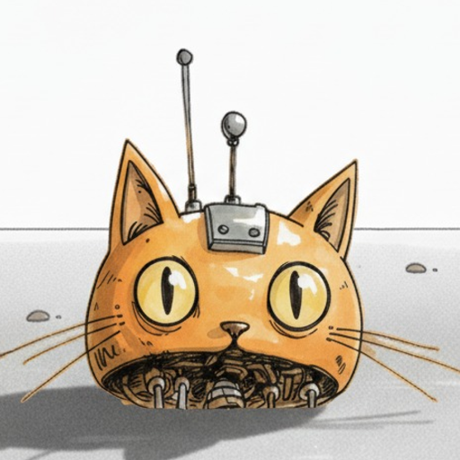

<p align="center">
  
</p>

<h1 align="center">mojo agent skills</h1>

<p align="center">
  Drop-in skills that teach any AI agent to be useful for <a href="https://mojoapp.ai">mojo</a> users on a GLP-1 weight loss journey.
</p>

---

[mojo](https://mojoapp.ai) is a weight-loss tracker purpose-built for GLP-1 medications (Mounjaro, Ozempic, Wegovy, Zepbound). This repository ships three small **skills** you can drop into your own AI agent (Claude Code, OpenClaw, or any runtime that loads `SKILL.md` files).

Each skill is plain text. No API calls. No telemetry. Nothing happens to your mojo account unless you tap a link the skill generates.

## The skills

### [`skills/mojo-food-log/`](skills/mojo-food-log/) — analyze a meal, log it to mojo

When you upload a food photo or describe what you ate, the agent acts as a registered dietitian, estimates calories + macros + fiber, and produces a one-tap **Import to mojo** link.

> **You:** I had a chicken bento for lunch — rice, fried thigh, green vegetables.
>
> **Agent:** *[full nutrition table…]*
> [Import to mojo](https://api.mojoapp.ai/nutrition/add?calories=735&...)

Uses the verbatim prompt that mojo ships in-app for copy-pasting into other LLMs, so the experience stays consistent.

### [`skills/mojo-glp1-knowledge/`](skills/mojo-glp1-knowledge/) — your knowledgeable peer for GLP-1 questions

When you ask about Mounjaro, Ozempic, Wegovy, Zepbound, side effects, dosing, pen mechanics, or storage, the agent answers thoughtfully — drawing on a curated knowledge base (Mounjaro KwikPen specifics, common community misconceptions corrected, residual-medication guidance) plus its own medical knowledge.

> **You:** Is the 10 mg Mounjaro KwikPen really only 10 mg total?
>
> **Agent:** No — 10 mg is per *weekly* dose. The pen holds 4 × 10 mg doses = 40 mg total. *[…proceeds to explain pen geometry, why this confusion is common, and one safety reminder…]*

Always pairs the answer with a clear "I'm not your doctor" disclaimer for anything actionable.

### [`skills/mojo-app-docs/`](skills/mojo-app-docs/) — answers about the mojo app itself

The full user-facing documentation site (the same one at [docs.mojoapp.ai](https://docs.mojoapp.ai)) is bundled in four languages (`en`, `zh-TW`, `zh-Hant-HK`, `zh-Hans`). When you ask "how do I cancel my subscription", "how does the streak counter work", or "where do I enter my body fat", the agent reads the matching page and answers in your language.

---

## Install

### Claude Code

```bash
git clone https://github.com/mojoapp-ai/agent-skills.git ~/agent-skills

# Install any subset of skills — or all of them
cp -r ~/agent-skills/skills/mojo-food-log         ~/.claude/skills/
cp -r ~/agent-skills/skills/mojo-glp1-knowledge   ~/.claude/skills/
cp -r ~/agent-skills/skills/mojo-app-docs       ~/.claude/skills/
```

To stay in sync with upstream updates, symlink instead of copying:

```bash
ln -s ~/agent-skills/skills/mojo-food-log         ~/.claude/skills/mojo-food-log
ln -s ~/agent-skills/skills/mojo-glp1-knowledge   ~/.claude/skills/mojo-glp1-knowledge
ln -s ~/agent-skills/skills/mojo-app-docs       ~/.claude/skills/mojo-app-docs
```

Then `cd ~/agent-skills && git pull` whenever you want the latest.

### OpenClaw

Drop each skill directory into your agent's shared skills folder (typically `<agent-workspace>/skills/_all/` or `<agent>/skills/`). The `SKILL.md` frontmatter is compatible with both runtimes.

### Other agent runtimes

Any agent that loads skills from a directory of `SKILL.md` files (Anthropic SDK skills, custom harnesses) will work. Point it at the `SKILL.md` inside each skill folder.

---

## A note on the import link

The link `mojo-food-log` generates — `https://api.mojoapp.ai/nutrition/add?...` — is a redirect page, not a true universal link. On a phone it opens mojo via URL scheme; if the app is missing, it falls back to the App Store / Play Store. On desktop you'll see a "please open this on your phone" prompt — that's by design.

Importing food into the user's log requires a **mojo Premium subscription**. Free users will see a paywall.

Full parameter spec: [`skills/mojo-food-log/references/deep-link-spec.md`](skills/mojo-food-log/references/deep-link-spec.md).

---

## Privacy

- ❌ No API calls.
- ❌ No telemetry. No usage reporting.
- ❌ No data leaves your agent, ever.
- ✅ Each skill is one or more markdown files. You can read every byte before you install.

---

## Get mojo

- iOS: <https://apps.apple.com/app/id6751704399>
- Android: <https://play.google.com/store/apps/details?id=com.hanamizuki.mojo>
- Web: <https://mojoapp.ai>
- Docs: <https://docs.mojoapp.ai>

---

## License

[MIT](LICENSE). Use it, fork it, embed it, modify it. Underlying user-docs content (in `skills/mojo-app-docs/references/`) is © mojoapp.ai and bundled here under permission.
